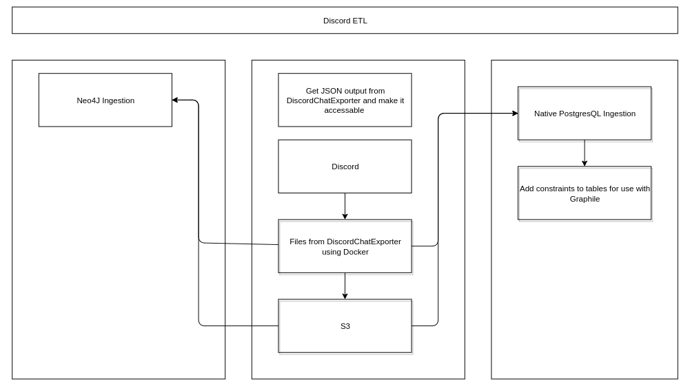
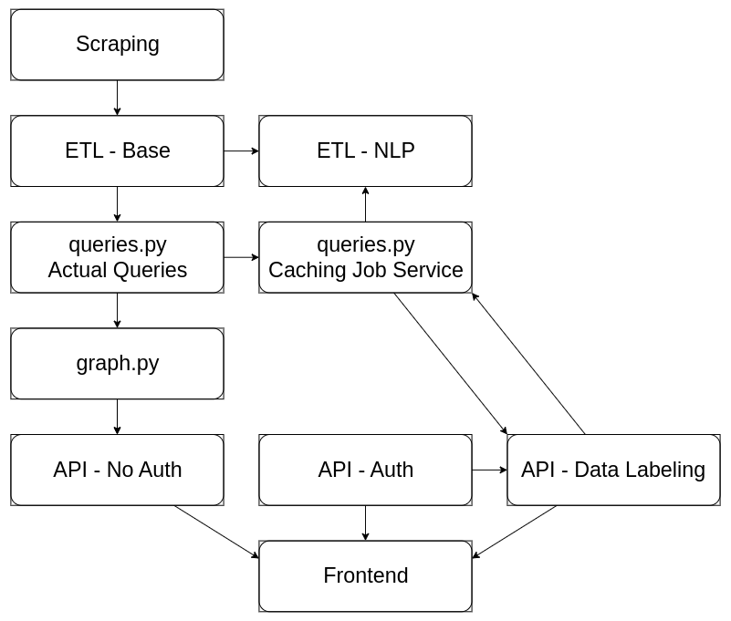

## Source Code -> [dentropy/discord-binding](https://github.com/dentropy/discord-binding)

## Roadmap -> [Roadmap - Discord Binding](/dc6a1ac7-60f0-452d-9536-9fed6d92bc51)

[Why am I working on the the discord binding project?](/Why am I working on the the discord binding project?)

## Description

Take data exported from discord guilds via [DiscordChatExporter](/DiscordChatExporter) then transform it into a [Postgres](/5d70cd64-3134-4b62-8879-12f1f8bb4afe) database, with separate tables for guilds, channels, messages, authors, reactions, attachments, roles, and mentions in order to make analysis of data easier. I am going to develop tooling to generate ad curate context for Discord Guilds.

## Motivation

I personally find it difficult to navigate all discord guilds given how much notice there is. I am just thrown in channels. 

If I am going to look through the archive of a Discord Guild I want to know who can be my guide, there is a query for that. If I am searching for an answer for a specific topics within a discord guild I want powerful search with embeddings in a vector database, named entity recognition, and semantic search.

## Project Management Links

* [Discord Binding User Stories](/a976ba89-4013-4831-ab31-b5d59a7ae971)
* [Questions Discord Binding is trying to answer?](/Questions Discord Binding is trying to answer?)
* [What people am I targeting with the Discord Binding project?](/What people am I targeting with the Discord Binding project?)
* [Questions for Discord Data](/46abc67b-bbe7-4800-82f5-f08d4c457ef0)
* [Dentropy Daemon Roadmap](/8d4d461f-49f7-4dbd-829f-807d0bb602df)
- [Catechism - Discord Auditing, DAO use Case V0.0.1](/a5fc0cc8-0abb-4192-8675-b98e8ee9fad4)
- [DAO Auditing via Discord - Design Decision Logs](/DAO Auditing via Discord - Design Decision Logs)
* [DAO Auditing via Discord - Design Questions](/DAO Auditing via Discord - Design Questions)
* [Discord Binding](/1c376bfd-75ef-4c0d-9e23-3680653de55f)

## ETL Diagram

## [ETL](/7e381790-c582-4f58-9350-ef2e51efa9cf) Steps

* **Discord to Filesystem or S3 using [DiscordChatExporter](/DiscordChatExporter)
	* Make a discord account and join a couple guild
		* [Where to find Discord Guilds to Join?](/Where to find Discord Guilds to Join?)
	* Get Discord Authentication Token
		* [How to get Discord User Token?](/How to get Discord User Token?)
	* Scrape a single Discord Guild
		* [How to scrape a Single Discord Guild?](/How to scrape a Single Discord Guild?)
	* Scrape all data on a single Discord Account
		* [How to scrape a data from a Single Discord Account using DiscordChatExporter?](/How to scrape a data from a Single Discord Account using DiscordChatExporter?)
	* Copy files from Guild to S3 using RClone
		* [What do I do about those RClone Errors from copying Discord Data to S3?](/What do I do about those RClone Errors from copying Discord Data to S3?)
* **S3 or File system to Postgres or Neo4J**
* **Export Postgres to desired Formats**
## Application Dependency Diagram

## Links

* [Roadmap - Discord Binding](/dc6a1ac7-60f0-452d-9536-9fed6d92bc51)
* [Discord Software](/Discord Software)
* [Discord Binding Archive](/Discord Binding Archive)
* [How to get Discord User Token?](/How to get Discord User Token?)
* [Discord Datapipeline](/Discord Datapipeline)
* [Discord Bot](/Discord Bot)
* [Discord Schema](/Discord Schema)
* [Discord Datapipeline](/Discord Datapipeline)